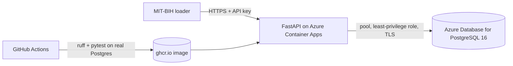

# PulseStore

A REST API that ingests ECG recordings and beat annotations and stores them in PostgreSQL,
built to practise the work of a database engineering team: schema design, measured query
tuning, least-privilege security and tests against a real database.

[](https://github.com/alejamadri05-glitch/pulsestore/actions/workflows/ci.yml)

> Public, de-identified data only (MIT-BIH Arrhythmia Database). Not a medical device.

## Architecture



The loader posts recordings the way a device fleet would: one recording, then its signal in
10-second segments, then its beat annotations. The service writes annotations with `COPY` and
serves heart rate per minute and filtered beat lists. It runs on Azure: the database on Azure
Database for PostgreSQL Flexible Server and the API on Azure Container Apps, scaled to zero
([docs/azure.md](docs/azure.md)).

## Results

All measured, all reproducible with the scripts in `scripts/`. Environment and raw runs are in
[`docs/results.md`](docs/results.md).

| What | Result |
|---|---|
| Load all 48 MIT-BIH records through the API | 8,688 signal segments, 109,494 annotations, 74 MB, 40 s |
| Ingest 109,494 annotations | **COPY 0.52 s** · `executemany` 2.06 s (4×) · one INSERT per row 17.4 s (33×) |
| One minute of beats for a recording | 3.41 ms → **0.018 ms**, 806 → 5 buffers (composite index) |
| Abnormal beats of a recording | 4.74 ms → **0.050 ms**, 806 → 31 buffers (partial index) |
| Heart rate per minute | 6.54 ms → 1.73 ms: the window function and sort dominate, not the scan |
| Beats per class, all recordings | 32.9 → 21.6 ms by aggregating before joining; one recording 0.65 ms |
| Same queries on Azure (B1ms) | 2–4× slower than the laptop, **identical buffer counts**; `lz4` there stores the same signal in 91 MB against 58 MB with `pglz` |
| Deployed service under load | 70 req/s, 0 failures, p95 240 ms end to end from Costa Rica; caching the one full-scan endpoint halved database CPU (61 % → 32 %) |
| Cost of the indexes on ingest | composite +61 %, partial +1 % |

Three findings worth more than the speed-ups:

- **TOAST compressed the signal 2.1×** (125 MB of samples in 58 MB). The first draft of the ADR
  predicted it would not; the ADR now carries the measured number.
- **The build guide's database role would have broken the API.** `INSERT … ON CONFLICT DO
  UPDATE` needs UPDATE privilege even when nothing conflicts. The fix is a column-level grant,
  `UPDATE (model) ON devices`, verified by tests that run the whole suite as that role.
- **The same query pattern is fine in one place and a trap in another.** An optional filter,
  `(param IS NULL OR col = param)`, costs 1.4× on the list endpoint (kept), but about 55× on the
  beat distribution, where it blocks pushing the filter into an aggregation (split into two
  statements).

## Design decisions

- [ADR 0001](docs/adr/0001-signal-storage.md): signal as 10-second `REAL[]` segments, not one
  row per sample (8,688 rows instead of 31 million).
- [ADR 0002](docs/adr/0002-no-phi.md): pseudonymous subject codes only, enforced by the API
  *and* by a `CHECK` constraint.
- `text` + `CHECK` instead of `char(1)`; indexes added only after measuring without them
  ([`migrations/002_indexes.sql`](migrations/002_indexes.sql)).

## Operations

- **Telemetry:** OpenTelemetry to Application Insights. Requests, database calls as
  `postgresql` dependencies, and two service metrics on the ingest path
  (`annotations_ingested`, `ingest_batch_size`). `/healthz` reports whether telemetry is on,
  which separates a broken deployment from a misconfigured one.
- **Measured in production** (server-side, from Application Insights): `GET /heart-rate` p95
  12 ms, `GET /stats/beat-distribution` p95 21 ms, `SELECT` dependencies p95 8 ms.
- **Alert:** database CPU above 80 % for 5 minutes emails an action group. Exercised by
  loading the database on purpose, which is written up in
  [docs/postmortems/](docs/postmortems/).
- **[Runbook](docs/runbook.md):** what each alert means, the first commands to run, the known
  causes with their fixes, and the recovery steps in order of disruption.

## Security

- The API connects as `pulse_app` ([`migrations/003_app_role.sql`](migrations/003_app_role.sql)):
  `SELECT` and `INSERT` on four named tables plus one column-level `UPDATE`. Tests confirm that
  `DELETE`, `TRUNCATE`, other `UPDATE`s and any DDL are refused.
- All SQL is parameterized. API keys are compared in constant time. No secrets in git.
- Dependabot watches pip and GitHub Actions.

## Run locally

```bash
docker compose up -d                       # PostgreSQL 16; migrations run on first start
docker compose exec db psql -U pulse -d pulsestore \
  -c "ALTER ROLE pulse_app PASSWORD 'pulse-app-local'"
python3.12 -m venv .venv && .venv/bin/pip install -r requirements-dev.txt
cp .env.example .env && set -a && . ./.env && set +a
.venv/bin/uvicorn app.main:app              # http://localhost:8000/docs
.venv/bin/python scripts/load_mitbih.py --download --all
.venv/bin/pytest -q                         # starts its own PostgreSQL via Testcontainers
```

The benchmarks create and drop indexes, so they run as the admin user:

```bash
DATABASE_URL=$ADMIN_DATABASE_URL .venv/bin/python scripts/bench_ingest.py
DATABASE_URL=$ADMIN_DATABASE_URL PYTHONPATH=. .venv/bin/python scripts/bench_queries.py
```

## Status

| Phase | State |
|---|---|
| Schema, ADRs, local API | Done |
| Load all 48 records, ingest benchmark | Done |
| Tests against real PostgreSQL (31) | Done |
| Query tuning with before/after numbers | Done |
| Least-privilege role, parameterized SQL, Dependabot | Done |
| CI: lint and tests on every push | Done, green on GitHub (PostgreSQL 16 via Testcontainers) |
| Docker image (326 MB, non-root, runtime deps only), published to GHCR from `main` | Done |
| API authenticates to Azure with Entra tokens (`DB_AUTH=entra`), no password | Done, verified against Azure |
| Azure Database for PostgreSQL: Entra-only auth, migrations, `pg_stat_statements` ([docs/azure.md](docs/azure.md)) | Done |
| Azure: Container Apps, monitoring, OIDC deploy | Next |
| Load test | Next |

## Data

MIT-BIH Arrhythmia Database, [PhysioNet](https://physionet.org/content/mitdb/) (ODC-By).
Moody GB, Mark RG. *The impact of the MIT-BIH Arrhythmia Database.* IEEE Eng Med Biol, 2001.
Goldberger AL et al. *PhysioBank, PhysioToolkit, and PhysioNet.* Circulation, 2000.

This project reuses the dataset and the AAMI beat-class mapping from
[ecg-arrhythmia-classifier](https://github.com/alejamadri05-glitch/ecg-arrhythmia-classifier),
which classifies the same beats with inter-patient evaluation.
